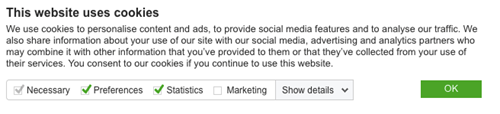

# GDPR Cookies Highlights
###### This document is a quick summary of the information found on https://www.cookiebot.com/en/gdpr-cookies/

## Personal Data
#### GDPR-Definition of Personal Data
In the General Data Protection Regulation, the data to be protected is defined as follows (our italics):
<ul>
<em>(26): The principles of data protection should apply to any information concerning an identified or identifiable natural person.

Personal data which have undergone pseudonymisation, which could be attributed to a natural person by the use of additional information should be considered to be information on an identifiable natural person.</em>
</ul>

#### What Type of Cookies are Considered Personal Data?

When cookies can identify an individual, they are considered <strong>Personal Data</strong> and therefore subject to GDPR.

The General Data Protection Regulation regards e.g.
<ul>
<li>a name, </li>
<li>a photo, </li>
<li>an email address, </li>
<li>bank details,</li>
<li>posts on social networking websites, </li>
<li>medical information, </li>
<li>a computer IP address as personal data.</li>
</ul>

If your website or organization processes data that is <strong>(a) directly personal, or (b) can be combined or singled out to identify an individual,</strong> then it must be revised to meet the requirements.

## What features should be present in a GDPR-compliant cookie consent?
One of the most tangible requirements of the GDPR is in the definition of what constitutes a proper cookie consent, meaning, that the consent has to be:
<ul>
<li>informed</li>
<li>based on a true choice</li>
<li>Given by means of an affirmative, positive action that can not be</li> <li>misinterpreted.</li>
<li>Given prior to the initial processing of the personal data.</li>
<li>Withdrawable</li>
<li>The user has the right to be forgotten</li>
<li>All given consents must be recorded as documentation</li>
</ul>

## Example of a GDPR Compliant Cookie Consent Banner
 
 
#### Reasons this complies with the regulations:
<ul>
<li>All loaded scripts but the strictly necessary ones are paused until the consent to the cookies has been given ( "prior consent")</li>
<li>Information about the cokkies is <strong>accurate, specific, clear, and plain language</strong></li>
<li>The user can choose to have the details of the cookies shown</li>
<li>Cookies are grouped into 4 <strong>comprehensive categories, that the user may check or uncheck</strong></li>
<li>The user can change their mind about consent at any time</li>
<li>All given consents are <strong>securely stored as documentation</strong></li>
<li>Every 12 months, upon the user’s first visit to the site, the consent pops up again asking for a <strong>renewal of the consent</strong></li>
</ul>

#### Requirements of GDPR cookie policy
<ul>
<li>Transparent cookie policy</li>
<li>Overview and accountability for cookies on your website</li>
<li>Consent requested by means of an affirmative action</li>
<li>Possibility to withdraw the consent at any time</li>
<li>Renewal of consent</li>
<li>User friendly, no-nonsense dialogue</li>
<li>Prior consent</li>
<li>Consents must be recorded as evidence</li>
</ul>
